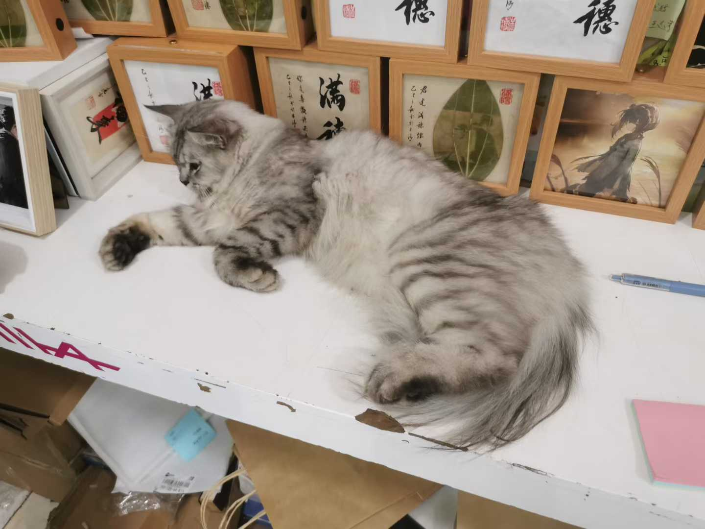
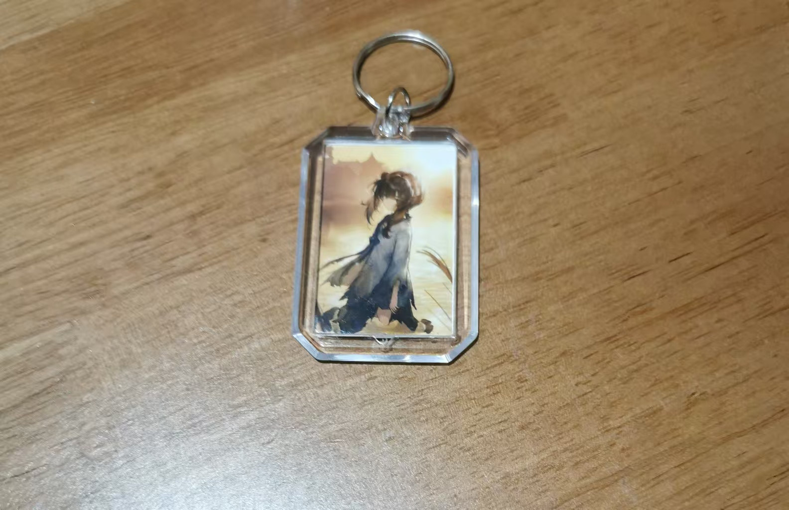
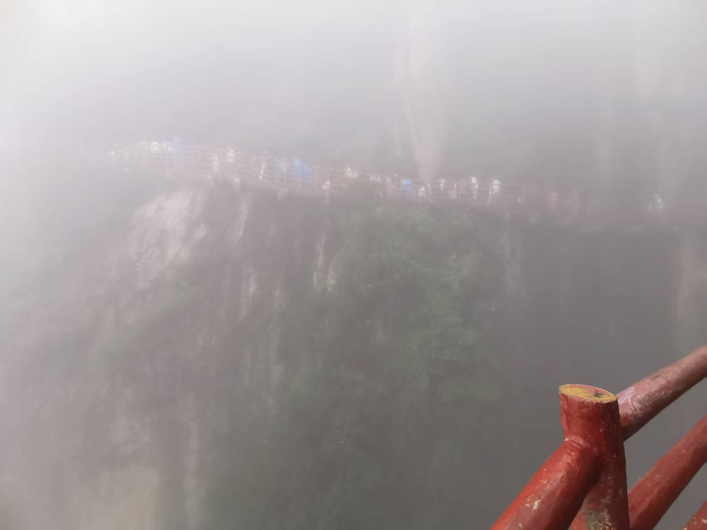

## 2025-08-23

### 3:00

到洛阳了。


### 5:00

稍作休整，吃晚饭。


号称小碗牛肉汤，拼尽全力只战胜一半不到，地址南关小碗牛肉汤。

### 5:30

前往古城。


正好撞上搞活动，人山人海。

### 6:00

牢〇取景地#1 - 湖边


文峰塔静静地守望着，杨柳如故人般飘散，白云缓动，天蓝好似故人眸。

蒹葭苍苍，白露为霜。所谓伊人，在水一方。

啊，满穗……

之后，在古城里随意逛了逛。

### 6:25

来到鼓楼。


既然是来巡礼的，最终目的地几乎一定是听劝大爷店。





刚进店不久，就开始下雨。不一会，便发展成了倾盆大雨。北方也经常下大雨吗？兴许是老天爷作祟，故意让我在店里多留留。大概世界就是这么玄学吧。

店主很热情，很有看法，跟我们穗友们侃侃而谈。至于说了什么，也许只有亲自体验才能体会，在此给各位想来的穗友卖个关子。店的外面是故事，里面更是故事。

顺带一提，店里的狸奴太可爱了，好想再摸摸。



穗穗真可爱 :)

### 7:15

趁雨看上去小了点，赶紧离开，鬼知道雨会不会变大。虽然还是很大，但仍旧硬着头皮走了下去。

走之前不小心踩到猫尾巴了，遂抚摸安抚猫猫情绪。没想到那猫直接软趴下撒娇了。洛阳的猫都是这么可可爱爱的吗？

出门后，趁机给穗穗拍几张照。


雨中行走，诸多不便。鞋子一不小心就会湿。

快到丽景门时，拦了个车，叫她送回酒店。那车喇叭响的要命，耳朵快坏了。司机不怀好意，绕点路从10块加到15，最后甚至差点多算三倍价钱。

下车后，雨也停了。

### 8:00

回到酒店休息，写游记。

准备洗澡睡觉。

### 10:00

暑假作业……

推了一会Phigros，睡觉。

## 2025-08-24

### 7:30

起床。酒店里吃好早餐，便匆匆忙忙赶上车了。

行程规划允许腾出一天爬山。

穗穗今天睡得好香，怎么叫都起不来了（幻想时间.jpeg）

### 8:00

启程。

### 10:00

睡得好香，终于到山脚了。

### 12:00

在山上吃午饭。

你们北方人是不是不会包馄饨啊……

### 1:00

道可道，非常道；名可名，非常名。景可景，非常景。

可惜大雾遮走大片，不过倒也滋生另一派景象：虚实相生。





### 4:00

下山。

### 8:00

才吃晚饭……

本地司机推荐老洛阳面馆，于是就去了。这个点还排队，证明它的确好吃。在排到队前，去了近处的应天门逛逛。


### 10:00

终于回酒店。

好累……

推了Phi，然后睡觉。


## 2025-08-25

### 8:00

睡到自然醒。好香。

### 9:00

给穗穗去白马寺里拜一拜\~\~据说这里的大雄宝殿特别灵\~\~


祝各位穗友：

- 穗穗平安

- 年年有成

- 心想事成

- 穗满良田\~

祝各位OIer：

```cpp
while(competition) rp++;
```

顺便探望一下旁边躺着的狄仁杰：


### 2:30

和穗穗的美好下午

## 2025-08-26

### 7:15

**(to be continued......)**

---

upd 2025-08-26: 更新24~26号的事件。
