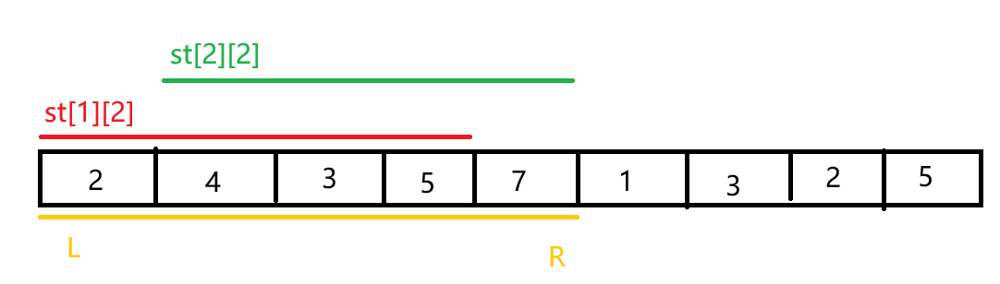

## 01 什么是ST表

ST表（Sparse Table，稀疏表）是一种可以解决区间最值查询问题（RMQ）的数据结构，建表时间复杂度 $O(n \log n)$ ，查询则为 $O(1)$ 。

除了RMQ，一些“不怕重复算”的问题（区间gcd，区间位或，区间位与等）都可以用ST表。

## 02 原理

暴力解决RMQ问题，查询达到了 $O(n)$ 级别。如果能用类似二分的思想加速就好了。

定义 $st[i][j]$ 表示**从 $i$ 号下标开始，往后 $2^j$ 个位置的最小值**。（最大值同理）

为什么这样做？

这样一来，对于区间 $[l, r]$ ，总能用$st$中的某两个区间覆盖，如图。



要计算$[l, r]$的最小值，只需比较两段预处理过的区间最小值即可。

### 两个分区间的端点怎么算

小区间长度只需将大区间长度向下取到 $2^k$ 即可。

第一个小区间的左端点就是 $l$ ；

第二个小区间右端点为 $r$ ，因此左端点就是 $r - len + 1$ 。

设 $j = \lfloor log_2(r - l + 1) \rfloor$ ，两区间可表示为 $st[l][j]$ 和 $st[r - 2^j + 1][j]$ 。

于是 $min([l, r]) = min(st[l][j], st[r - 2^j + 1][j])$ 。

### 如何初始化 $st$

从 $0$ 到 $log_2 m$ 遍历 $j$ ：

- 当 $j = 0$ 时，显然 $st[i][j] = arr[i]$ 。

- 当 $j \ne 0$ 时， $st[i][j]$ 可以由更小的区间更新，即 $st[i][j] = min(st[i][j - 1], st[i + 2^{j - 1}][j - 1])$ 。
  
  - 注意区间右端点可能越界，即 $i + 2^{j} - 1>len(arr)$ 。

## 03 代码实现

```cpp
#include <iostream>
#pragma O3

using namespace std;

int arr[100002];
int st[100002][32];
int lg[100002];

void init(int m) {
    // 预处理log2(n)
    // 使用<cmath>自带log2会返回double，有精度问题，且时间复杂度更大
    lg[1] = 0;
    lg[2] = 1;
    for (int i = 3; i <= m; i++) {
        lg[i] = lg[i / 2] + 1;
    }

    for (int j = 0; j <= lg[m]; j++) {
        for (int i = 1; i <= m; i++) {
            if (j == 0) {
                st[i][j] = arr[i];
            } else if (i + (1 << j) - 1 <= m) {
                st[i][j] = max(st[i][j - 1], st[i + (1 << (j - 1))][j - 1]);
            }
        }
    }
}

int query(int l, int r) {
    int j = lg[r - l + 1];
    return max(st[l][j], st[r - (1 << j) + 1][j]);
}

int main(){
    ios::sync_with_stdio(false);
    cin.tie(nullptr);
    cout.tie(nullptr);

    int m, n;
    cin >> m >> n;
    for (int i = 1; i <= m; i++){
        cin >> arr[i];
    }

    init(m);

    for (int i = 0; i < n; i++){
        int a, b;
        cin >> a >> b;
        cout << query(a, b) << '\n';
    }
}
```

## 04 总结

ST表具有代码量小、复杂度低等优点，但无法实现修改操作，且能扩展的玩法有限。

例题：

[P3865 【模板】ST 表 &amp; RMQ 问题 - 洛谷](https://www.luogu.com.cn/problem/P3865)

[P3145 [USACO16OPEN] Splitting the Field G - 洛谷](https://www.luogu.com.cn/problem/P3145) ST表的简单应用

[P1890 gcd区间 - 洛谷](https://www.luogu.com.cn/problem/P1890) ST表维护区间GCD
