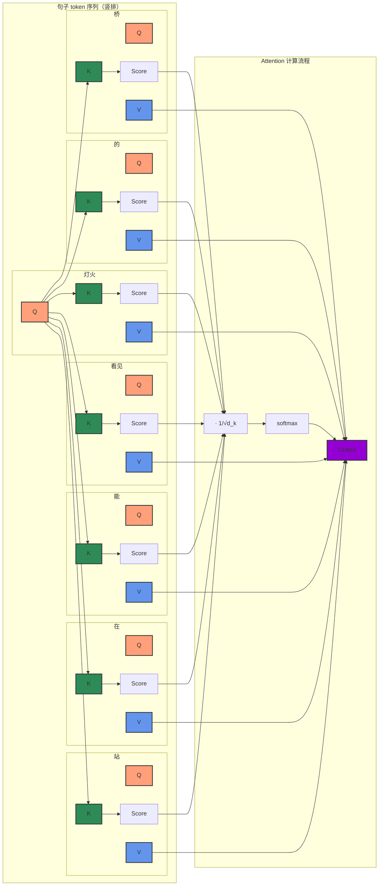
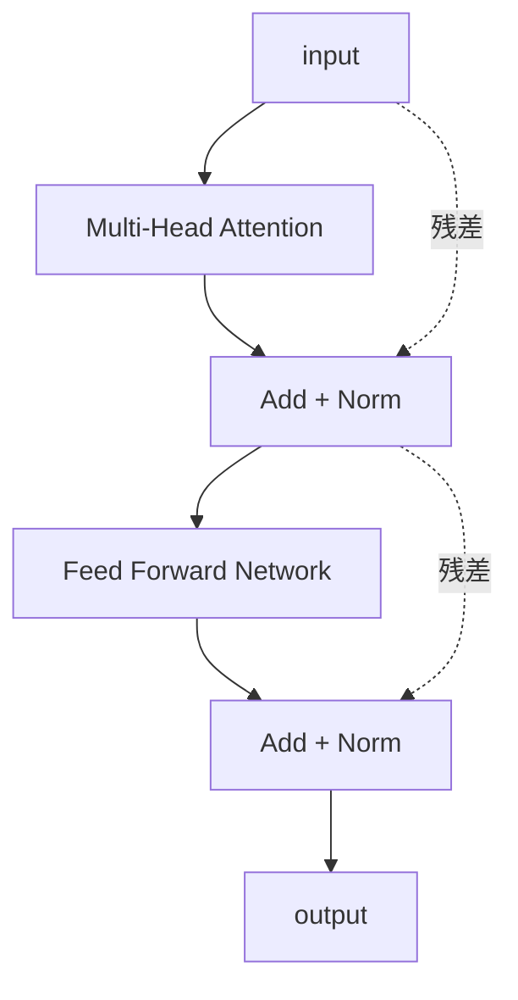
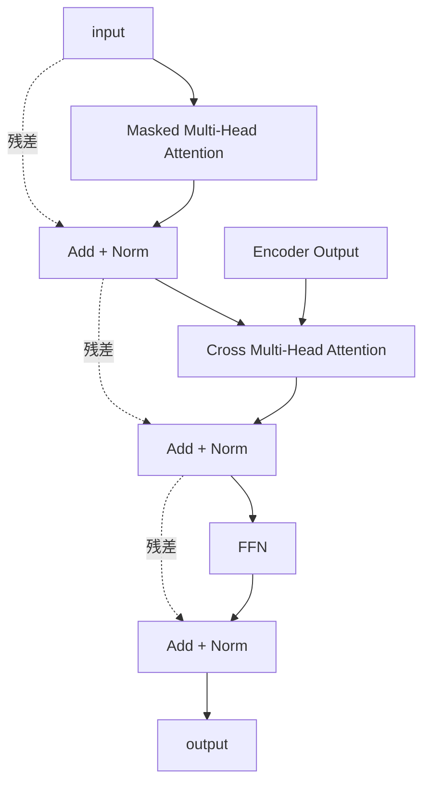
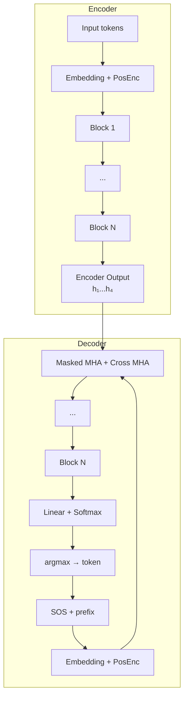

# Transformer架构

## 01 引言

在传统的NLP技术当中，通常用RNN（循环神经网络）或LSTM（长短期记忆神经网络）实现从序列到序列的映射。RNN/LSTM 通过逐步循环实现这一功能，但受限于串行计算和长距离衰减：串行计算浪费时间，而长距离的序列处理又易产生**梯度消失**或**梯度爆炸**。
因此，在2017年，**Google**员工在论文《Attention is all you need》中，提出了今天的主题——**Transformer架构**。

Transformer通过其独有的**Self-Attention自注意力机制**，使其对长距离依赖的建模得到有效提升，并实现了高效的并行计算，奠定了后续ChatGPT等模型发展的基础。

## 02 Self-Attention 自注意力机制

Self-Attention自注意力机制的基本原理，就是用**查询 $Q$** 查询**键值 $K$** 找到**值 $V$**。这类似于
在百度 / Google上搜索信息：我们在输入框当中输入**关键词**查询到**各个网页**，寻找其中和我们的需求关系最大的网页，点进去**了解具体信息**。

### 2.1 Embedding 词嵌入

在进入真正的自注意力之前，我们首先需要先了解一下词嵌入。

我们会把一个长段落先用**分词器**分作不同的**Token（词元）**。Token会被赋予一个token id，并进入**词嵌入层 / Embedding**。

为了理解词嵌入层，请回答以下问题：

> 搬动这**沉重**的砖块，他感到心里很**沉重**。
> 
> 请问：这里的两个**沉重**分别表示什么含义？

我们发现，往往一个词语在不同的情形下表示不同的意思。为了刻画这一点，我们可以使用一个**可训练的多维向量**来表达一个token的含义。这样，我们让词语在不同环境下有不同的向量方向，有效区分语义。

### 2.2 Self-Attention 单头自注意力机制

为了模拟人类检索信息的过程，我们首先根据词向量 $x_i$ 提取出查询、键、值（$Q$ / $K$ / $V$）：

$$
Q = x_i \cdot W_Q \\
K = x_i \cdot W_K \\
V = x_i \cdot W_V \\
$$

其中 $W_Q, W_K, W_V$ 都是可学习的矩阵。

那么，查询操作便可刻画为：

$$
\text{AttnScore} = Q \cdot K^T
$$

为了把注意力分数缩放到和为 $1$ ，将其归一化之后输入softmax层：

$$
\alpha = \text{softmax}(\frac{\text{AttnScore}}{\sqrt{d_k}})
$$

其中 $d_k$ 是键向量的维度。

> 为什么有这个 $\sqrt{d_k}$ ？
> 
> 
> **这是因为点积的数量级增长很大，结果的方差期望会达到 $d_k$，而 softmax 恰恰对尖锐分布的输入敏感，因此将 softmax 函数推向了梯度极小的区域**，除以一个 $\sqrt{d_k}$ 可以把方差化作 $1$ 并防止梯度饱和。

要汇总全部的查询结果，将所有 $V$ 加权求和：

$$
\text{Output} = \sum{\alpha V}
$$

以“站在能看见灯火的桥”为例，“灯火”一词计算注意力的过程如图：



对每一个词语计算一遍注意力，我们便完成了Self-Attention层。

### 2.3 Multi-Head Attention 多头自注意力

有的时候，往往一句话有多种理解方式。因此，我们常常同时训练多组 $W_Q, W_K, W_V$ ，让模型从不同角度理解一段话。每一组参数都是一个注意力头。有研究表明，模型确实在不同的注意力头中学习到了不同的东西。

## 03 Transformer

Transformer 借助 **自注意力（Self-Attention）** 和 **Encoder-Decoder 结构**，能够实现 **N → N′** 的映射：

- 输入序列长度 = **N**
- 输出序列长度 = **N′**，可以与 N 不同

这使得机器翻译、文本摘要、语音合成等任务可以直接在端到端的框架下完成。

> **例：闽南语 / 台语 TTS（Text-to-Speech）**  
> 将闽南语文字序列（N）转换为声学特征帧序列（N′）。由于闽南语是低资源语言，Transformer 的自注意力能够捕捉复杂的声调与连读变调规律。

> “大力出奇迹” – "硬 train 一发"
> 
> 尽管训练数据可能带有背景音乐、环境噪音等干扰，但只要模型足够大、算力足够强，“硬着头皮 train 一发”往往就能收敛到可用的效果。这体现了当前大模型时代的核心信念：**规模（scale）能解决许多问题**。

### 3.1 统一的抽象框架：seq2seq

无论是翻译、语音合成还是句法分析，都可以抽象为：

```
input sequence → [ seq2seq ] → output sequence
```

#### NLP 应用的一种统一视角：转化为 QA 任务

绝大多数 NLP 问题都可以转化为 **Question-Answering** 任务：

- 情感分类 → 问“情感是什么？” → 答“积极”
- 命名实体识别 → 问“哪些是人名？” → 答“张三、李四”
- 文本摘要 → 问“这段文字的主要内容？” → 答出摘要

这种统一简化了模型设计，也便于零样本/少样本推理。

#### seq2seq 的泛化能力远超 NLP

Transformer 作为 seq2seq 模型，同样适用于：

- **句法分析（syntactic parsing）**：将句子序列映射为线性化的句法树（括号表示法）
- **多标签分类（multi-label classification）**：输出标签序列（如 `动物 宠物 可爱`）
- **目标检测（object detection）**：如 DETR，将图像划分为 patch 序列，输出检测框序列（类别 + 坐标）

### 3.2 Encoder-Decoder 骨架

```
input seq → Encoder → Decoder → output seq
```

#### 3.2.1 Encoder：从 x 到 h

表面上看，Encoder 完成了：

```
x₁ x₂ x₃ x₄ → Encoder → h₁ h₂ h₃ h₄
```

这与 RNN/LSTM 的 N → N 接口一致。**但内部实现完全不同**。

##### Encoder 结构：堆叠的 Block

```
x → [Block] → [Block] → ... → [Block] → h
```


每个 Block 的内部细节（以多头注意力为主）：



**步骤分解**：  

1. **Multi-Head Attention**：计算输入序列中所有位置之间的依赖关系  
2. **残差连接（Add）**：将注意力输出与原始输入相加，即 `a + b`  
3. **层归一化（Norm）**：对每个样本的特征维做归一化（使各特征均值 0、方差 1）  
4. **Feed Forward Network（FC）**：两层的全连接网络，中间维度通常扩至 4 倍  
5. 再次 **残差 + 归一化**

底层的输入处理：

```
Input tokens → Input Embedding → + Positional Encoding → 一堆 Block → Output
```

Input tokens → Input Embedding → + Positional Encoding → 一堆 Block → Output`

由于 Self-Attention 本身是置换不变的，必须通过 **Positional Encoding** 为每个位置注入顺序信息（通常使用正弦/余弦函数或可学习的位置嵌入）。

> ###### Positional Encoding是什么？
> 
> 注意到每个单词无论放在哪里都不影响注意力的计算结果，我们可以在原来的Embedding基础上叠加**位置向量**来表达位置信息。常见的位置编码包括基于正弦、余弦函数构建等等，当然现在也流行可训练的位置向量；叠加的方式包括加法、乘法等等。

##### 为什么必须这样设计？—— 不，你完全可以改！

> **事实**：你完全不必照搬 Transformer 的设计。  
> 改架构完全可以，甚至有时会更好。

例如：

- 使用 RNN/LSTM/GRU 作为 Encoder
- 使用 CNN（如 ConvS2S）
- 使用 State Space Models（如 Mamba）
- 去掉 LayerNorm 或用 BatchNorm 替换
- 改变残差连接的位置
- 替换位置编码方式（RoPE、相对位置等）

Transformer 只是 2017 年 *Attention Is All You Need* 提出的一种**有效**设计，凭借其并行性、长距离建模能力和训练稳定性成为主流默认选择，但绝非唯一真理。

#### 3.2.2 Decoder：自回归生成 N → N′

Decoder 是 **自回归（Autoregressive）** 的：每一步生成一个 token，并将其拼接到输入序列中，用于下一步的生成。

##### 生成过程

```
Step 1:  [SOS]                → Decoder → Linear → Softmax → max → word₁
Step 2:  [SOS, word₁]         → Decoder → Linear → Softmax → max → word₂
Step 3:  [SOS, word₁, word₂]  → ... → word₃
...
直到生成 [EOS] 停止
```

- **SOS**（Start of Sequence）：起始信号
- **EOS**（End of Sequence）：结束信号
- **Linear + Softmax**：将 Decoder 输出向量映射为词表上的概率分布
- **max / argmax**：选择概率最高的词作为当前输出（也可使用采样或 beam search）

整体来看，Decoder 实现了 **N → N′** 的映射（Encoder 输出长度固定，Decoder 输出长度可变）。

##### Decoder Block 结构

每个 Decoder Block 包含 **三个子层**，每一层后均有残差连接 + LayerNorm：



**关键组件：**

1. **Masked Multi-Head Attention**  
   掩码多头注意力，保证 **因果性**：生成第 t 个 token 时，只能看到第 1…(t-1) 个 token（即未来的 token 被 mask 掉）。确保模型由前推后。  

2. **Cross Multi-Head Attention**  
   
   - Query 来自 Decoder 上一层的输出
   
   - Key & Value 来自 **Encoder 的输出**
   
   - 作用：让 Decoder 在每一步都可以“关注”输入序列的不同位置，实现自动对齐。

3. **FFN + 残差 + 归一化**  
   与 Encoder 中的 FFN 相同。

### 3.3 自回归的困境：一步错，步步错？

自回归模型存在一个根本问题：**错误累积**（Error Accumulation）。  
如果某一步生成了错误的 token，后续所有 token 都会基于这个错误继续生成，导致输出质量断崖式下降。

> #### 比喻：推文接龙（Tweet Solitaire）
> 
> 想象一个游戏：每个人只能看到前面人写的推文，然后续写下一句。一旦前面某个人写偏了，后面所有人都会沿着错误的方向走。这就是自回归生成时的“接龙困境”。

### 3.4 非自回归（NAT）的尝试

为了缓解“一步错步步错”的问题，研究者提出了 **非自回归模型（Non-Autoregressive Transformer, NAT）**。

#### AT vs. NAT 对比

| 特性   | 自回归 (AT)          | 非自回归 (NAT)                 |
| ---- | ----------------- | -------------------------- |
| 生成方式 | 逐个生成，每一步依赖之前生成的结果 | 并行生成所有 token               |
| 输入信号 | 仅一个 `[SOS]`       | 多个 `[SOS]` 填充（长度 = 目标长度）   |
| 输出   | `w₁ w₂ w₃ … EOS`  | 一次性输出全部 token              |
| 长度预测 | 隐式通过 `[EOS]` 决定   | 需要额外预测长度（或忽略 `[EOS]` 后的内容） |

#### NAT 的核心问题

1. **如何确定输出长度 N′？**  
   
   - 方法一：额外添加一个 **长度预测器（Length Predictor）**
   
   - 方法二：先生成一个较长的序列，然后忽略 `[EOS]` 之后的所有 token

2. **输出可能不稳定**  
   由于缺少对已生成 token 的依赖，NAT 生成的 token 之间可能缺乏连贯性（例如重复、缺词）。

#### 权衡

- **AT**：质量高，但串行生成 → **慢**  
- **NAT**：并行生成 → **快**，但质量通常低于 AT，且不存在因错误累积而不稳定的问题。

## 04 总结：一张图看懂 Transformer



**核心要点回顾：**

- Transformer 实现了 **N → N′** 的灵活映射
- Encoder 使用无掩码的多头注意力 + 残差 + LayerNorm
- Decoder 使用 **Masked** 注意力保证因果性，并借助 Cross Attention 与 Encoder 交互
- 自回归生成存在错误累积风险 → 催生了非自回归（NAT）的研究
- 架构没有“必须这样设计”，理解为什么有效才能更好地创新
