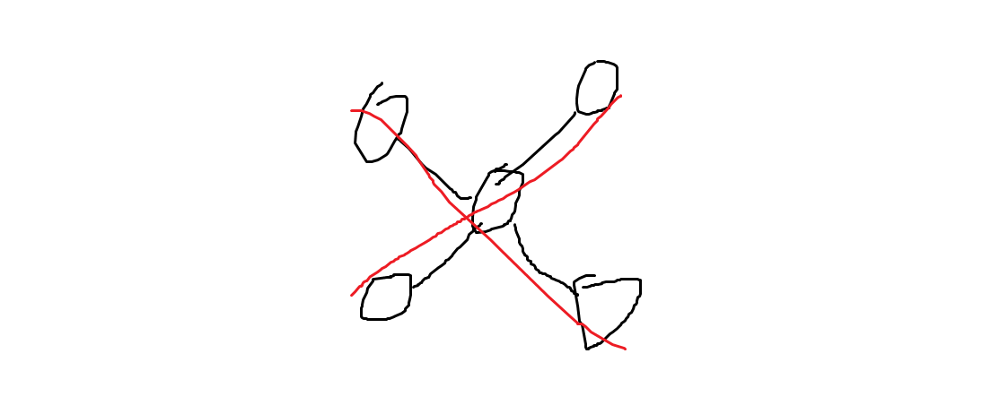
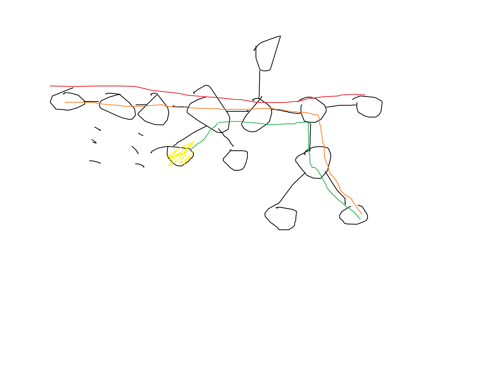
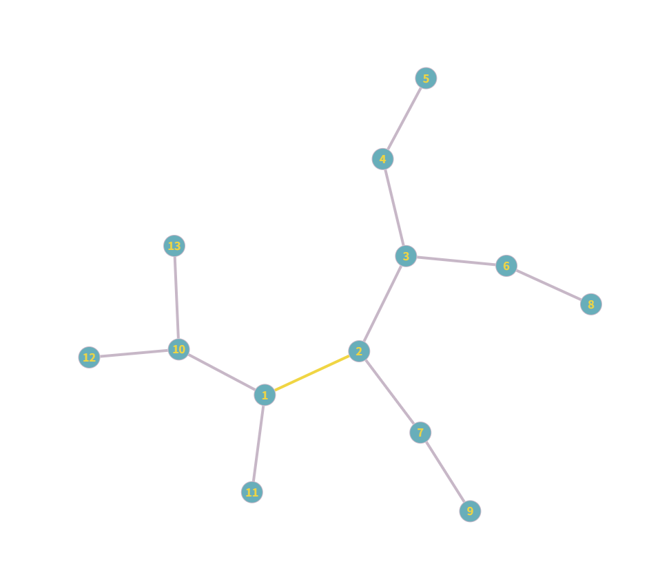

:::note

观前提醒：  
本笔记含有大量证明，不想看可选择性跳过

:::

# 树的直径

:::important

以下无特殊说明，所有树的边权（若有）均为正。
见[此处](https://spacecruising233.github.io/posts/tree-diamater/#04-%E6%B1%82%E6%B3%952---%E6%A0%91%E5%BD%A2dp)以求解带负权边的树的直径。

:::

## 01 定义

**树的直径**：树上最长的简单路径。

## 02 性质

1. 直径的两端点一定是叶子节点。

2. 到**任意**一点最远的点一定是直径的某个端点。（证明见下）

3. 在树上加点，每加一点树的直径长度变化量 $\le 1$ 。

4. **树的直径不一定唯一**，所有直径交于直径的中点。

性质1和性质3都很直观，此处略去不证。

### 证明（性质4）

如图，可说明树的直径不一定唯一。



对于命题的后半部分，考虑反证。

任取两直径，设两直径分别为 $(a, b)$ 和 $(c, d)$ 。（其中 $(a, b)$ 和 $(c, d)$ 不是同一条直径）

#### 情况1：两直径相交，但不交于某一直径的中点

设交点为 $p$ 。

不妨设： $(a, p) > (b, p)$ ， $(c, p) \ge (d, p)$ 。

由于 $(a, b) = (c, d)$ ，我们亦知： $(b, p) < (c, p)$

于是 $(a, c) = (a, p) + (c, p) > (a, p) + (b, p) = (a, b)$ ，与 $(a, c)$ 是直径矛盾。

#### 情况2：两直径不相交

考虑用一条路径 $(m, n)$ 连接两直径，以转成情况1。

> 为了方便，我们定义：   
> $(a, b)$ 到 $(a, c)$ 的岔路口是指同时在两路径上的最后一个节点。

设 $m$ 是 $(a, b)$ 和  $(a, d)$ 的岔路口，$n$ 是 $(d, c)$ 和 $(d, a)$ 的岔路口。

不妨设： $(a, m) \ge (b, m)$ ， $(c, n) \ge (d, n)$ 。

容易发现 $(a, m) \ge (d, n)$ 。

则 $(a, c) = (a, m) + (m, n) + (n, c) > (a, m) + (n, c) \ge (d, n) + (n, c) = (d, c)$ ，与 $(d, c)$ 是直径矛盾。

## 03 求法1 - 两遍DFS

该做法时间复杂度为 $O(n)$ 。

利用性质2，任取一节点为根，第一遍DFS遍历离根最远的点；再以最远的点为根，第二遍DFS再遍历离新根最远的点。

### 正确性证明

#### 直观理解

我们只需证：**第一遍DFS找到的最远的点是直径的一端**。

比如说，起始点不在直径上的情况。（其余情况类似）

我们把树的直径标为红色，假设这种方法找到的不是直径的一端：



那么橙色路径会取代红色路径，成为新的直径。

#### 严谨一点？

设直径两端点分别为 $a, b$ ，从 $s$ 开始搜寻，找到点 $d$ 。需要分类讨论。

- 若 $s$ 是 $(a, b)$ 上一点：那么 $(a, d) = (a, s) + (s, d) \ge (a, s) + (s, b) = (a, b)$ ，与 $(a, b)$ 是树的直径矛盾。

- 若 $s$ 不在 $(a, b)$ 上：
  
  - 若 $(s, d)$ 与 $(a, b)$ 相交于 $m$ ，类比上一点有 $(a, d) \ge (a, b)$ ，矛盾。
  
  - 若 $(s, d)$ 与 $(a, b)$ 无交点，我们希望：能够用一条路径把 $(s, d)$ 和 $(a, b)$ “接上“，转成上一种情况。
    
    于是设 $m$ 是 $(s, d)$ 与 $(s, b)$ 的岔路口，$n$ 是 $(b, a)$ 与 $(b, m)$ 的岔路口，应有：
    $(s, d) \ge (s, b)$
    两边同减 $(s, m)$ 得 $(m, d) \ge (m, b)$ ，
    而 $(n, d) = (m, d) + (m, n)$ ， $(n, b) = (m, b) - (m, n)$ ，
    说明 $(n, d) > (n, b)$，可以看作 $n$ 开始搜到 $d$ ，这就又回到了第一种情况。

于是定理得证。

:::note[为什么求法1不适用负权边]

"而 $(n, d) = (m, d) + (m, n)$ ， $(n, b) = (m, b) - (m, n)$ "  
不再能推出  
" $(n, d) > (n, b)$ "  
因为不能保证 $(m, n) > 0$ 。

:::

### 代码实现

```cpp
#include <iostream>
#include <vector>

using namespace std;

vector<int> graph[100005];

void add(int u, int v) {
    graph[u].push_back(v);
    graph[v].push_back(u);
}

int depth[100005];
int dfs(int p, int fa) {
    int res = p;

    for (int ch : graph[p]) {
        if (ch == fa) continue;
        depth[ch] = depth[p] + 1;

        int pt = dfs(ch, p);
        if (depth[pt] > depth[res]) res = pt;
    }

    return res;
}

int main(){
    int n;
    cin >> n;

    for (int i = 1; i < n; i++) {
        int u, v;
        cin >> u >> v;
        add(u, v);
    }

    int s = dfs(1, 0);
    depth[s] = 0;
    int d = dfs(s, 0);
    cout << depth[d];
}
```

## 04 求法2 - 树形DP

这种做法时间复杂度 $O(n)$ ，且**可以解决负权边的问题**。

我们先任取一点为根，记为 $1$ 号节点。

既然是树的直径，这个直径对于某棵子树来讲，一定是叶子节点 --> 根节点 --> 叶子节点的一条路径。这条路径可以由“到根最长” + “到根次长”来更新。

如果有负权边，此时直径不一定要取到叶子节点，“到根最长”和“到根次长”都不能过去，我们只需将其初始化为 $0$ ，更新时就能把负权边舍去了。

这样来看，维护好“到根最长”数组 $d_1$ 和“到根次长”数组 $d_2$ ，答案近在迟尺。

怎么维护？优先更新 $d_1$ ，剩下的给 $d_2$ 。

> [!NOTE]
> 
> 显然， $d_1[i]$ 和 $d_2[i]$ 不能有重边。

### 代码实现

```cpp
#include <iostream>
#include <vector>

using namespace std;

vector<int> graph[100005];

void add(int u, int v) {
    graph[u].push_back(v);
    graph[v].push_back(u);
}

int res = 0;
int d1[100005];
int d2[100005];
void dfs(int p, int fa) {
    for (int ch : graph[p]) {
        if (ch == fa) continue;

        dfs(ch, p);

        int d_new = d1[ch] + 1;
        if (d_new > d1[p]) {
            d2[p] = d1[p];
            d1[p] = d_new;
        } else {
            d2[p] = max(d_new, d2[p]);
        }
    }

    res = max(d1[p] + d2[p], res);
}

int main(){
    int n;
    cin >> n;

    for (int i = 1; i < n; i++) {
        int u, v;
        cin >> u >> v;
        add(u, v);
    }

    dfs(1, 0);

    cout << res;
}
```

事实上，还有另一种开一个数组的求法，见[OI Wiki](https://oiwiki.com/graph/tree-diameter/#%E8%BF%87%E7%A8%8B-2)。

# 树的重心

## 01 定义

**树的重心**：树上一点，使以它为根时，其最大子树最小。

可以理解为：把子树分割得最平均的位置。所谓平均，就是没有哪个子树太大（对应“最大子树最小”）。

## 02 性质

1. 某个点是树的重心，当且仅当：  
   其最大子树大小 $\le$ 整颗树大小一半。

2. 树恰好有一个重心 $\Leftrightarrow$ 树的大小为奇数  
   树恰好有两个重心 $\Leftrightarrow$ 树的大小为偶数  
   若树有两重心，其必然相邻。

3. 树中所有点到某点距离和最小 $\Leftrightarrow$ 此点为重心

4. 往树上加叶子节点，重心的距离改变量 $\le 1$ 。

5. 两棵树合并后，新的重心在两树原重心间路径上。
   
   **强化命题**：新的重心在较大树上；  
                      两树大小相同，则在连接点上。

几个性质不好一眼看出其证明，我们依次证明它们。

> 为方便，记 $sz(T)$ 表示树 $T$ 的大小；
> 
> $sz_u(v)$ 表示 $T$ 以 $u$ 为根时，包含 $v$ 的 $u$ 的子树大小。

### 引理

**沿一条边看两边子树的大小互补，和为整棵树的大小**。

形式化地，设无根树 $T$ 中 $u, v$ 为两相邻节点，有 $sz_v(u) + sz_u(v) = sz(T)$ 。

#### 证明

注意到：对任意节点 $w$ ，要么在 $t_u$ 上，要么在 $t_v$ 上即可。



如图，黄色边把 $T$ 分割成了两半，解释了引理的正确性。

### 证明（性质1）

#### 充分性

设树 $T$ 的重心 $G$ 分割出的子树大小 $sz(t_1) \ge sz(t_2) \ge ... \ge sz(t_n)$ 。

考虑反证：假设 $sz(t_1) > \frac{1}{2}sz(T)$ 。

取 $t_1$ 的根 $G'$ 。

当以 $G'$ 为根时：

- 其中必然有一颗子树 $t_G$ 由原来 $G$ 和 $t_2, t_3, ..., t_n$ 构成，由引理可知： $sz(t_G) = sz(T) - sz(t_1) < sz(t_1)$ 。

- 而 $G'$ 剩下的子树 $t'$ 都是 $t_1$ 子树，有 $sz(t') < sz(t_1)$ 。

综上有 $max(sz(t')) < max(sz(t))$ ，与 $G$ 为重心矛盾。

**直观理解**：如果从重心出发还有一块超过一半，那就往那一块里走一步，会把“最大块”压小，变得更好，说明原点不可能最优。

#### 必要性

设 $G$ 为树 $T$ 的重心。

由充分性可知：对 $G$ 的任意一子树 $t$ 有 $sz(t) \le \frac{1}{2}sz(T)$ 。

对树上任意一点 $G' \ne G$ ，当以 $G'$ 为根时：

- $G'$ 与 $G$ 相邻，由引理知 $sz(t_G) = sz(T) - sz(t_{left}) \ge \frac{1}{2}sz(T)$ ，因而 $max(sz(t')) \ge max(sz(t))$ 。等号成立，当且仅当 $max(sz(t')) = max(sz(t)) = \frac12sz(T)$ ，此时由重心定义可知 $G'$ 也是重心；否则， $G'$ 不可能是重心。

- 否则，在路径 $(G, G')$ 上利用引理进行递推，每次走一步，包含节点 $G$ 的子树都在扩大，最终一定 $sz_{G'}(G) > \frac12sz(T)$ 。换而言之， $G'$ 一定不是重心。

这样来看，**只有重心满足** $max(sz(t_i​)) \le \frac12sz(T)$ ，即证明了结论。

### 证明（性质2）

先证：**重心必然相邻**，这可以揭示许多性质。

假设一颗树 $T$ 有多于一个重心，任取其两重心 $G_1$ 和 $G_2$ 。

---

#### 小引理

$G_1$ 有一颗子树包含了 $G_2$ ，猜测：**这颗子树一定是最大子树**。

要想证明它，我们采取反证法。

设 $G_1, G_2$ 最大子树分别为 $T_1, T_2$ 。

假设最大子树在不含 $G_2$ 的一边： 

我们有 $sz_{G_2}(G_1) > sz(T_1)$ ，这是因为 $T_1$ 是 $G_2$ 包含 $G_1$ 子树的子树。然而，由重心的定义，应有 $sz(T_1) = sz(T_2) \ge sz_{G_2}(G_1)$ ，矛盾！

---

#### 法1

通常的证法是：**直接利用子树大小**。

小引理告诉我们： $T_1$ 一定通向 $G_2$ 方向，反之亦然。

如果 $G_1, G_2$​ 不相邻，则 $T_1(或T_2)$ 会在到达另一重心之前就包含其他结点，其大小必然超过 $\frac{sz(T)}2$ ​。

这与重心性质1矛盾。

#### 法2

这里还提供一种利用**容斥原理**的证法。

根据小引理，假设 $G_1$ 和 $G_2$ 不相邻，此时 $G_1$ 和 $G_2$ 间的部分成为了 $T_1$ 和 $T_2$ 的公共部分，其至少包含一个点。  

由于 $T_1$ 还包含了 $G_2$ 及其除 $G_1$ 所在子树外的所有子树， $T_2$ 同理；告诉我们 $T_1 \cup T_2 = T$ 。  

由容斥原理，  
 $sz(T_1) + sz(T_2) - sz(T_1 \cap T_1) = sz(T)$ ，    
由性质1易知 $sz(T_1) = sz(T_2) \le \frac12sz(T)$ ，   
矛盾！


这证明了命题后半部分。

---

由上定理，若一颗树有 $\ge 3$ 个重心，其必然成环，这不可能。所以一颗树**至多两个重心**。

同时，在 $T$ 有两个重心时，上述证明还告诉我们： $G_2 \in T_1, G_1 \in T_2$ ，于是乎，由重心定义  
$sz_{G_1}(G_2) = sz_{G_2}(G_1)$  
又由引理，它们之和为 $sz(T)$ ，说明 $T$ 的大小为偶；反之，若 $sz(T)$ 为奇，上等式不可能成立，于是 $T$ 不可能有两重心，证明了性质前半部分的后半句。

前半句是后半句的逆否，即得证。

这证明了性质的前半部分。

### 证明（性质3）

可以用**调整法**解决。

> 定义：  $dis(u)$ 表示某棵树 $T$ 内所有节点到 $u$ 的距离和。

#### 直观证明

任取不是重心的节点 $u$ ，存在相邻节点 $v$ 使 $sz_u(v) > \frac{sz(T)}{2}$ ，那么就令 $u' = v$ ，此时， $u$ 所有较小的子树中 $dis(u)$ 增加了 $sz(所有较小的子树)$ ，而在子树 $v$ 中 $dis(u)$ 减少了 $sz_u(v)$ ，于是 $dis(u') < dis(u)$ 。

循环往复，利用性质1，最终会走向一个“低谷”，即重心。

#### 形式化版本（thx to CatGPT）

先证明一个移动差分公式（关键恒等式）。

**引理（移动差分）**：若 $v$ 是 $u$ 的邻居，令 $s=sz_u​(v)$（即去掉边 $(u, v)$ 后，包含 $v$ 的那一部分的节点数），则

$dis(v)−dis(u)=n−2s$ 。

**证明**：从 $u$ 移到 $v$ ：

- 对属于 $v$ 那部分的 $s$ 个节点，距离都减少 $1$ ；

- 对其余的 $n−s$ 个节点，距离都增加 $1$ 。  
  所以差为 $−s+(n−s)=n−2s$ 。

---

##### （充分性）若 $u$ 使 $dis(u)$ 最小，则 $u$ 是重心

设 $u$ 最小化 $dis$。对任意邻居 $v$ 有 $dis(v) − dis(u) \ge 0$。由差分公式得

$n−2sz_u​(v) \ge 0⇒sz_u​(v) \le 2n$ 。

这正是重心的定义条件，因此 $u$ 为重心。

---

##### （必要性）若 $u$ 是重心，则 $dis(u)$ 最小

若 u 为重心，则对任意邻居 v，有 szu​(v)≤2n​。由差分公式，

$dis(v)−dis(u)=n−2sz_u​(v) \ge 0$

即走到任一邻居不增益。再用“调整法”递推：对任一起点 $w$ ，沿着一条简单路径朝向某个重心每一步若遇到邻边对应的子树大小 $> \frac{sz(T)}2$ 就能严格减小 $dis$ ；因为重心的定义保证没有这样的邻边，路径终止且到达某个重心。因此从任意点到重心的路径上 $dis$ 单调下降，重心处达到局部极小；结合上一段“最小 ⇒ 重心”，可知该局部极小即为全局极小 —— 换句话说，重心使 $dis$ 取最小值。

### 证明（性质4）

读者自证不难，留作习题答案略。

（什么玩意还挺上口）

### 证明（性质5）

直觉上容易感觉到其成立。

设 $sz(T_1) \ge sz(T_2)$ 的原重心分别为 $G_1, G_2$ ，合并的边为 $(x, y)$ 。

- **转移思路**：若在 $G_1$ 看作候选重心，其相邻子树中只有 $T_2$ 方向的子树大小可能超过 $\tfrac{sz(T)}{2}$。因为在 $T_1$ 内，$G_1$ 本来就是重心，一定满足性质1。

- 若 $sz(T_2)$ 足够小，使 $sz_{G_1}(T_2) \le sz(T)$ ，则 $G_1$ 依然是树 $T$ 的重心。

- 否则， $G_1$ 不再是重心，必须沿着 $(G_1, G_2)$ 的路径前进（因为只有这一个方向能减小“最大子树”）。依次调整，必然找到某点 $G'$ 满足最大子树 $\le \tfrac{sz(T)}{2}$，此时 $G'$ 就是新重心。显然 $G'$ 在 $(G_1, G_2)$ 的路径上。

- 特别地，若 $sz(T_1) = sz(T_2)$，则重心恰落在 $x, y$ 处；若不等，重心落在较大树一侧。

## 03 求法

模版题：[P1395 会议 - 洛谷](https://www.luogu.com.cn/problem/P1395)

利用性质1来求即可，时间复杂度 $O(n)$ 。

```cpp title=&amp;quot;P1395.cpp&amp;quot;
#include <iostream>
#include <vector>

const int INF = 1e9 + 7;

using namespace std;

vector<int> graph[50005];

void add(int u, int v) {
    graph[u].push_back(v);
    graph[v].push_back(u);
}

int sz[50005];
void getsz(int p, int fa) {
    sz[p] = 1;
    for (int ch : graph[p]) {
        if (ch == fa) continue;
        getsz(ch, p);
        sz[p] += sz[ch];
    }
}

int res = INF;
void dfs(int p, int fa) {
    int sz_max = sz[1] - sz[p];
    for (int ch : graph[p]) {
        if (ch == fa) continue;
        dfs(ch, p);
        sz_max = max(sz_max, sz[ch]);
    }

    if (sz_max <= sz[1] / 2) res = min(res, p);
}

int dist = 0;
void get_dist(int p, int fa, int d = 0) {
    dist += d;
    for (int ch : graph[p]) {
        if (ch == fa) continue;
        get_dist(ch, p, d + 1);
    }
}

int main(){
    int n;
    cin >> n;

    for (int i = 1; i < n; i++) {
        int u, v;
        cin >> u >> v;
        add(u, v);
    }

    getsz(1, 0);
    dfs(1, 0);
    cout << res << ' ';
    get_dist(res, 0);
    cout << dist;
}

```

# 树的中心

:::important

WIP / Work In Progress
施工中

:::

## 01 定义

**树的中心**：树上一点，使到任意一点距离的最大值最小。

可以理解为：到各点距离最平均的点。

## 02 性质

## 03 求法

# 小结

参考资料：

[算法学习笔记(72): 树的重心](https://zhuanlan.zhihu.com/p/357938161)
